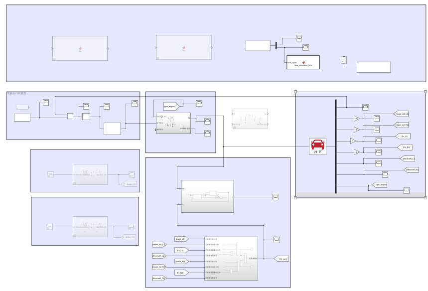
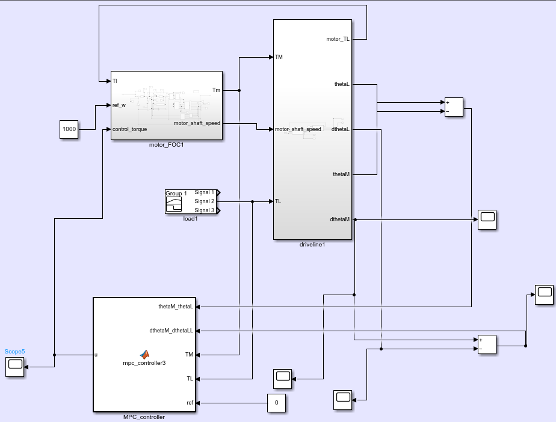

# Reinforcement Learning Study & Simulation

This repository contains resources for Reinforcement Learning (RL) study, including theoretical notes and practical implementation demos combining Python and Simulink.

## 📂 Directory Structure Overview

### 1. `demo_python&simulink`
This directory focuses on the implementation of **Model-Free Reinforcement Learning** algorithms applied to a physical system.

* **Environment:**
    * Contains a dynamics model of an **Inverted Pendulum (Cart-Pole)** system constructed using **MATLAB Simscape**.
    
* **Co-Simulation:**
    * Implements a joint simulation framework bridging **Python** (agent/algorithm) and **Simulink** (environment/physics).
* **Algorithms:**
    * The following algorithms have been implemented and tested:
        * **DQN** (Deep Q-Network)
        * **AC** (Actor-Critic)
        * **PPO** (Proximal Policy Optimization)

### 2. `learning_note`
This directory serves as a knowledge base for RL theory.

* Contains comprehensive study notes covering the theoretical foundations of Reinforcement Learning.
* Includes mathematical derivations, core concepts, and summaries of key algorithms.

### 3. Recent Work

This section showcases ongoing research projects focusing on advanced vehicle dynamics control and electric drivetrain optimization.

#### 🚗 Longitudinal Dynamics & Vibration Suppression (Co-Simulation)

* **Overview**: High-fidelity longitudinal dynamics simulation bridging **Simulink** and **Carsim**.
* **Key Features**:
    * Implemented a **Composite Braking Strategy** coordinating with an **Electro-Mechanical Brake (EMB)** controller.
    * **Multi-Objective Optimization**: The braking strategy explicitly accounts for **drivetrain torsional vibration** suppression and **component reliability**, optimizing torque distribution to minimize fatigue damage during deceleration.

#### ⚡ MPC-based Drivetrain Control

* **Overview**: Controller design for the electric drive motor and drivetrain subsystem.
* **Key Features**:
    * Designed a **Model Predictive Control (MPC)** algorithm specifically for suppressing torsional vibrations.
    * Focuses on the precise torque management of the drive motor to enhance system stability and reduce wear.

---
*Created by [ziyan_Wang]*